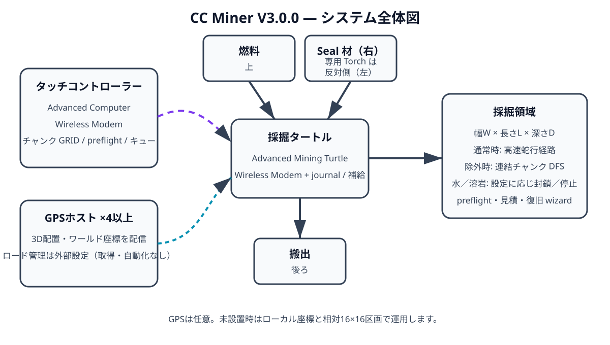

# 00. 全体設計

CC Miner V2.1 は、採掘タートルを「移動する状態機械」として扱います。コントローラーはジョブと制御命令を送信し、ワーカーは物理操作の前後を永続化しながら採掘、帰還、搬出、補給、復帰を実行します。

## 構成要素

### ワーカー

Advanced Mining Turtle に Wireless Modem を装着します。ローカル座標はドックを `(0,0,0)`、正面を `+Z`、右を `+X`、下を `-Y` とします。

通常ジョブは全セルを連続して通る高速蛇行経路を使います。チャンク除外が1件以上ある場合は、許可チャンクの連結性を検証してから、チャンク単位のDFS往復経路へ切り替えます。各チャンク内部は連続蛇行で採掘し、チャンク間移動と補給帰還は許可チャンクのアンカーだけを通ります。

### コントローラー

複数ワーカーの状態をRednetで収集します。キーボードだけでなく、端末の `mouse_click` とAdvanced Monitorの `monitor_touch` を同じヒットボックス処理へ流します。画面サイズごとに再描画し、ワーカー行、操作ボタン、数値キーパッド、チャンク一覧を直接操作できます。

### GPSホスト

`gps` 役割は組み込みの `gps host` を自動起動します。4台以上を立体配置し、それぞれへ無線モデムブロックのワールド座標を設定します。

GPSは任意です。校正済みワーカーでは以下に使います。

- ドックのワールド座標と正面ベクトルの保存
- ローカル座標からワールド座標／チャンク座標への変換
- 一定移動数ごとの位置検証
- 電源断が移動の直前か直後かの判定
- REHOME時のドック位置確認

### ドック

搬出、燃料、溶岩封鎖材の3系統を分離します。採掘物を搬出するときも、封鎖用ブロックはタートル内へ保持します。

## 状態保存

`/ccminer/data/state.db` にジョブ、座標、向き、補給チェックポイント、チャンク経路カーソル、統計、保留アクションを保存します。書き込みは一時ファイルからの入れ替えで行い、直前の完全な状態を `.bak` に残します。

物理操作は次の順序です。

1. `pendingAction` に操作前座標と期待される操作後座標を保存
2. タートルAPIを呼び出す
3. ローカル座標と統計を更新
4. 必要に応じてGPS検証
5. `pendingAction` を消して確定

電源断時に保留操作が残っていた場合、GPSで位置を特定できる移動・採掘・設置は自動復旧できます。旋回は位置だけでは向きを判定できないため、手動REHOMEが必要です。

## チャンク除外

GPS校正済みでは実際のワールドチャンク `(floor(X/16), floor(Z/16))` を使います。未校正時は採掘原点基準の相対16×16区画を使います。

入口セル `(0,0,1)` を含むチャンクは除外できません。除外後に許可チャンクが複数の島へ分断される場合、到達不能領域を残さないためジョブを拒否します。

## 通信

全メッセージにはマジック値、スキーマ、ネットワークキー、送信元、宛先、メッセージIDを含めます。ワーカーは最近処理した命令IDを保持し、再送された命令を二重実行しません。
