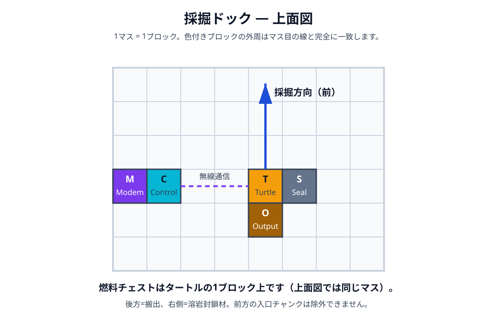
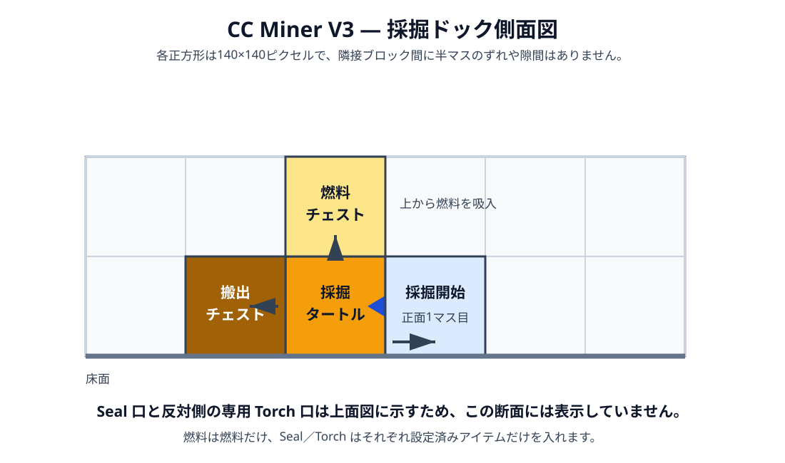
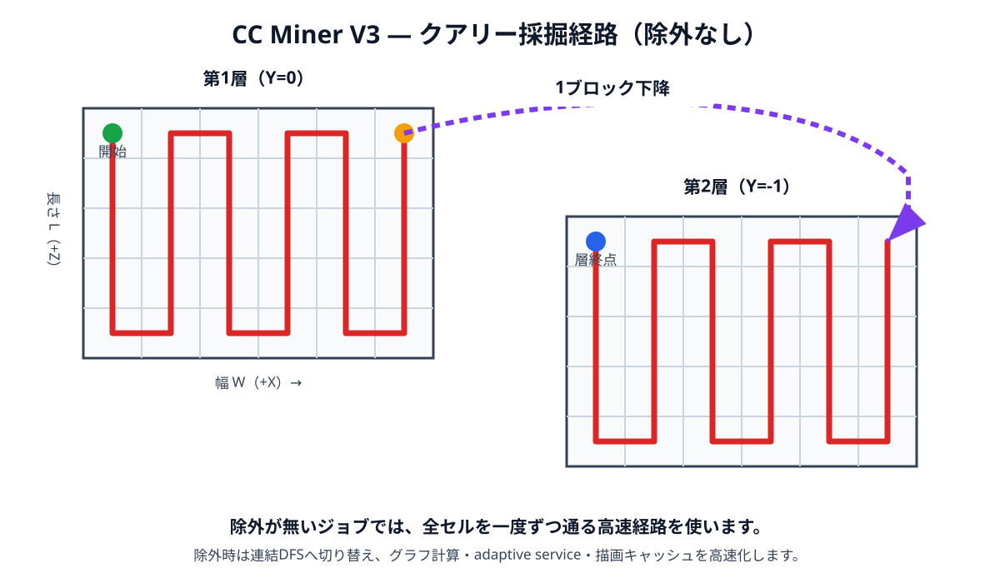
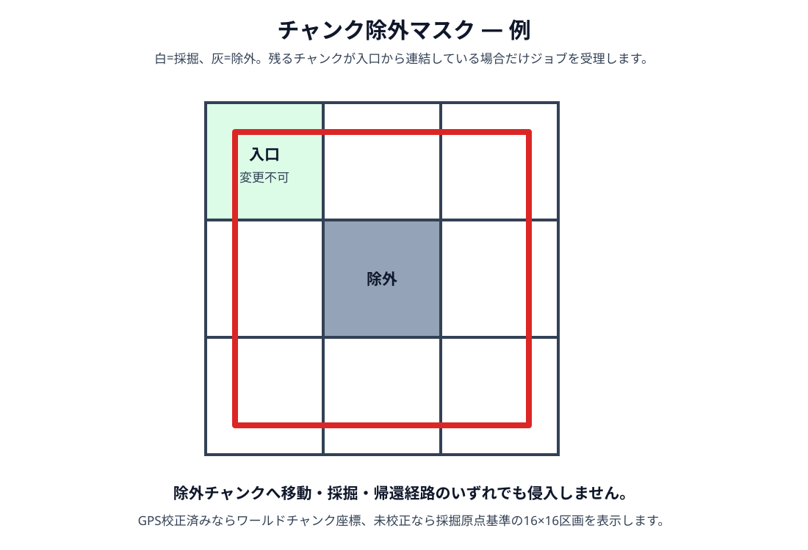
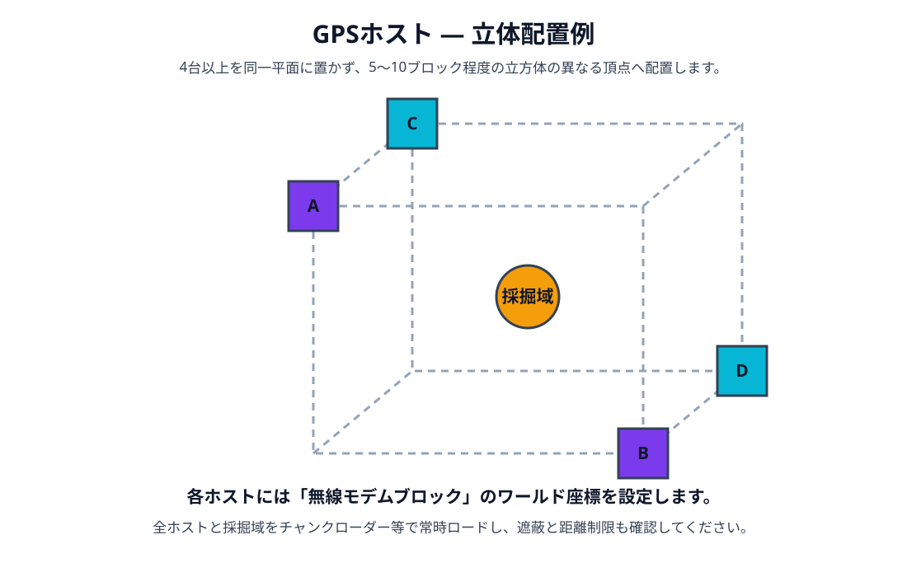

# 02. 建築と配置（V3）

## ドック上面

1 マスは 1 ブロックです。タートルの正面を採掘方向へ向け、後ろに搬出、上に燃料、seal 材チェストと専用 torch チェストを左右へ置きます。既定は **seal=右／torch=左** で、torch は seal 側の反対側です。図の `S` は seal 系統を表します。

燃料チェストはタートルの真上、搬出チェストは真後ろです。帰還後、タートルは必要な向きへ旋回して搬出・補給します。アンロード中の停止要求はその境界を journal へ保存し、次回ロード時に未完了の搬出・補給を再検証します。通常の 1×1 坑道では左右の 1 ブロック niche に torch を置き、保護／容器／液体／重力ブロックを避けます。両側が塞がる場合は安全停止し、custom floor fallback の失敗は非致命です。

## 採掘方向と経路

- 幅 `W`: ドックから見て右（`+X`）
- 長さ `L`: 正面（`+Z`）
- 深さ `D`: 下（`-Y`）
- 最初の採掘セル: 正面 1 ブロック

除外なしは連続蛇行、除外ありは許可チャンクの DFS アンカー経路とチャンク内蛇行です。採掘・補給・帰還のいずれも除外チャンクへ入らないことを preflight で確認します。

## チャンクグリッドの作り方

グリッドは **1 タイル = 1 チャンク** で、部分セルはありません。

1. NEW JOB で寸法を入力し、`CHUNK GRID` を開きます。
2. 初期状態と **ALL** は全チャンク採掘、**CLEAR** は入口以外を解除します。
3. 個別タッチで切り替え、**RECT** は二点で囲んだ矩形だけを採掘対象にします。
4. **INVERT** で入口を固定したまま反転し、入口チャンクが残っていることを確認します。
5. 色（入口、採掘対象、除外、採掘済み、進行中、停止）と件数を確認して preflight へ進みます。

GPS 校正済みならワールドチャンク座標、未校正なら採掘原点基準の相対チャンクです。world queue の `targetY` は GPS world のみで、`depth = homeY - targetY + 1`。local queue は入力した depth を使います。単一 footprint を複数 worker へ分割する機能は安全上無効で、複数 worker は非重複な独立 queue job を指定順に dispatch します。

## 物流・通知の配線（任意）

有線仕分けを使う場合は **controller** の Wired Modem から source inventory を valuable／bulk／seal の各送出先へ接続します。満杯・切断中の送出先は残留して次 tick に再試行し、worker の `waiting_output` とは直結しません。

speaker は完了・停止・復旧要求・補給待ちの音を、redstone は設定した面の信号を出します。信号は通知であり、ドア・ピストン・チャンクローダーを自動制御する権限機能ではありません。

## GPS ホスト

4 台以上を異なる高さの立体範囲へ分散し、各ホストへ無線モデムブロックのワールド X/Y/Z を設定します。通信距離、ディメンション、遮蔽、サーバー側のロード設定は Modpack 依存です。CC Miner はチャンクロード状態を問い合わせたり、ロードを有効化したりしません。

## 設置後の確認

1. タートル正面に最低 1 ブロック、GPS CAL 用の往復スペースがある
2. 搬出チェストに空き、燃料チェストに燃料、Seal 材口と反対側の専用 Torch 口に許可アイテムがある
3. 採掘石の再利用を使う場合、予約スロットと保持上限を設定している
4. ワーカーとコントローラーの Wireless Modem が有効で、同じネットワークキーを使う
5. speaker、redstone、有線仕分けを使う場合、接続名・面・通知イベントを設定している
6. GPS を使う場合、4 台以上が起動し、ドックで GPS CAL が成功する
7. `ccm dashboard` で小さい範囲を作り、preflight と見積が期待どおりか確認する
